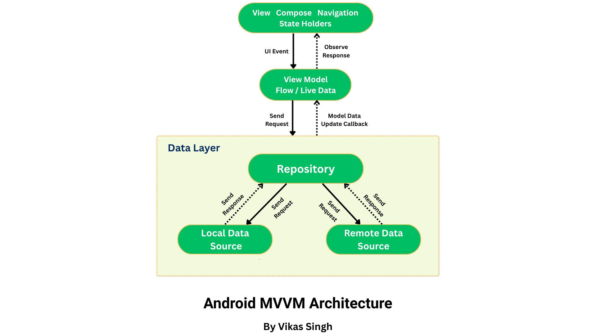
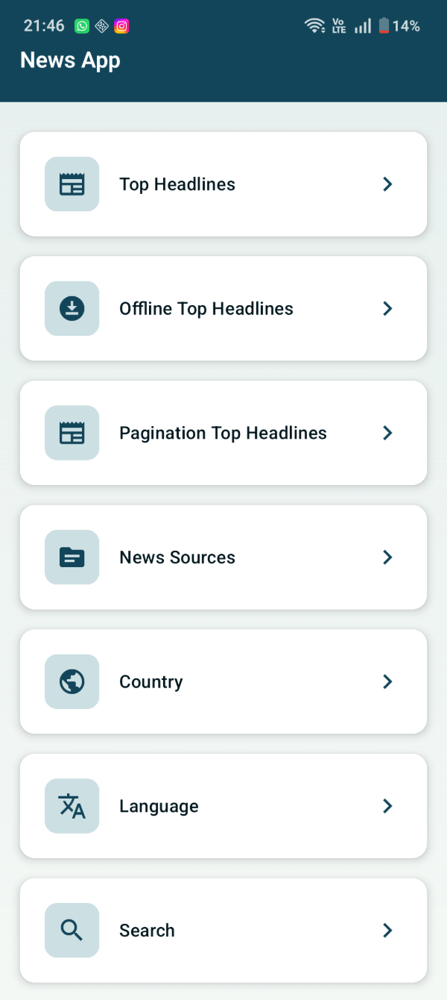
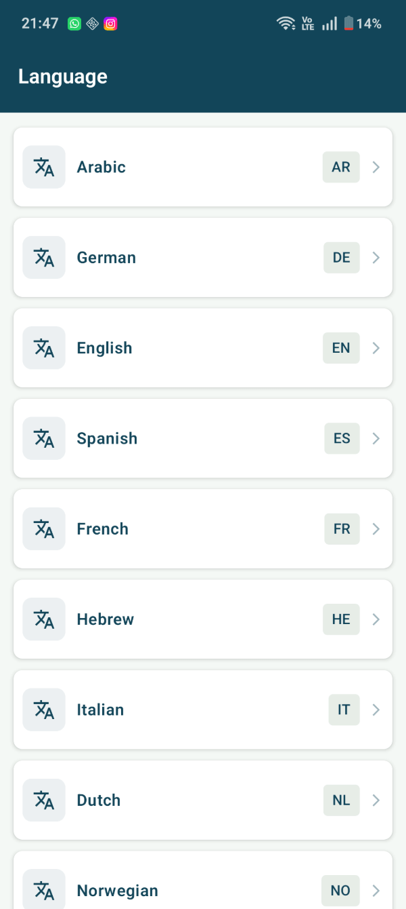
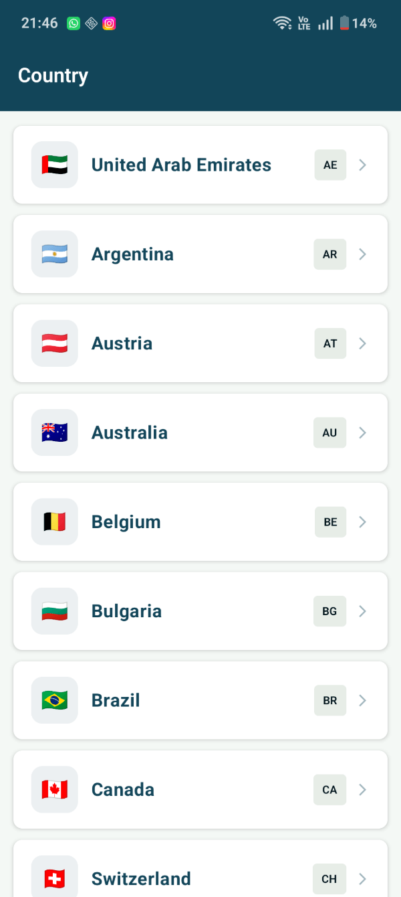

# Production-Ready Offline-First News App with Clean Scalable Architecture, Compose along with Smart Sync.

A Kotlin-Compose-MVVM Scalable Clean Architecture Project with Offline First Approach, Dagger & Hilt DI, Database Migration, Unit Testing and many more things.

## 🚀 Features Highlight -

-   🗞️ Latest Top Headlines
-   🔍 Instant Search (Debounce + DistinctUntilChanged)
-   📄 Pagination using Paging 3
-   📡 Offline-First Support (Room DB)
-   🌍 Country-wise News
-   🌐 Language-wise News
-   🧾 News Source Filtering
-   🔄 Background Sync using WorkManager
-   ⚡ Smooth UI with Jetpack Compose

# Android MVVM Clean Architecture

### A Kotlin(Compose) MVVM Clean Architecture project with Offline fist approach Using Dagger-Hilt, Compose, Room DB along with Migration, Unit Test, WorkManager & many more.


---

## Major Project Highlight -

-  **Jetpack Compose** for modern UI Development
-  **Dagger-Hilt** for efficient Dependency Injection
-  **WorkManager** for background sync & periodic news fetching
-  **Room DB** for local storage of article headlines
-  **Paging 3** for pagination
-  **Retrofit** for seamless network call
-  **Kotlin Serialization** data parsing efficiently without reflection
-  **Coroutines & Flow** for asynchronous operations
-  **StateFlow** for data state management
-  **Unit & UI test** for app performance & robustness
-  **Material Design** for modern UI design & Animation
-  **Migration -** xml to jetpack compose
-  **Migration -** Dagger 2 to Dagger-Hilt
-  **Migration -** Room DB Migration
-  **Kotlin & Kotlin DSL**
-  **Navigation** for seamless navigation among screens
-  **Search** instant search feature implemented
-  **Coil** image loading with success, failure, network case & caching.
-  **Web View** for seamless news article browsing.


## Upcoming Features -
-   **Notification** - for alerting about latest news
-   **Swipe To Delete** - delete article by left or right swipe with undo
-   **Dark Mode** - toggle dark mode
-   **Pull Down To Refresh** - refresh news on pull down.
-   **Conversion into Multi-Module Architecture** With a separate branch we will build it soon as a
    Multi-module industry standard scalable architecture as Recommended by Google

## Branches -
-   **main** - Jetpack Compose using Dagger-Hilt
-   **xml-dagger-hilt** - UI using xml with Dagger-Hilt
-   **xml-dagger2** - UI using xml with Dagger2

## Migrate XML to Jetpack Compose
-  **Update Android Gradle Plugin and Kotlin Plugin:** Using the latest versions of the Android Gradle Plugin and Kotlin Plugin.
-  **Add Compose Dependencies:** build.gradle (module-level)
-  **Set Up Compose Application:** Create a new @Composable function
-  **Replace XML Layouts with Compose Code:** For example, if you had an XML layout with a
   TextView, replace it with a Compose Text element.
-  **Alias:** Aliases Removed in Compose
-  **Code Segregation :** code segregation for best scalability & maintainability.
-  **Adopt Compose Components:** Replace XML-based UI components with their Compose equivalents.
-  **Integrate Compose Navigation:** Migrate from XML-based navigation to Compose Navigation.
-  **Migrate UI Logic:** Update UI logic to use Compose's state management.
-  **Migrate Resources:** Migrate string resources, colors, drawable.
-  **Update Gradle Plugin Versions:** Update your Gradle dependencies accordingly.
-  **UI Testing:** Write tests for your Compose UI using the Compose testing library.
-  **Documentation and Learning:** - Refer to the official Jetpack Compose documentation and
   samples.
-  **Learn about Compose concepts :** like Composables, state management, state hoisting, side
   effects, navigation, recomposition, snapshot, stateless composable, stateful composable,
   Modifier, Theming, Scrolling, Column, Row , Remember and many more things.

## Migrate Dagger2 to Dagger-Hilt
-   **Add Hilt Dependencies:** Add Dagger-Hilt dependencies to build.gradle file and remove Dagger2.
-   **Project Build Plugin:** build.gradle alias(libs.plugins.hilt.android) apply false in Project level
-   **App Build Plugin:** id("com.google.dagger.hilt.android")
-   **Centralized Dependencies:** All dependencies added in .toml file also beneficial for
    multi-module project building, "Single source of truth" for dependencies reference.
-   **Annotation Processor:** ksp(libs.hilt.compiler) it is faster instead of kapt, official fully
    supported now.
-   **Annotation Updated:** All Dagger2 annotations updated to Dagger-Hilt accordingly.
-   **Dagger Module:** Dagger Module of Activity & Application is replaced, Qualifier updated.
-   **ViewModel Injection:** View Model injection also updated.
-   **View Model Provider Factory:** View Model Provider Factory Removed, Hilt automatically
    manage this production.

## Purpose of Dependencies
-   **Jetpack Compose for UI:** Modern UI toolkit for building native Android UIs
-   **Coil for Image Loading:** Efficiently loads and caches images
-   **Retrofit for Networking:** A type-safe HTTP client for smooth network requests
-   **Dagger Hilt for Dependency Injection:** Simplifies dependency injection
-   **Room for Database:** A SQLite object mapping library for local data storage
-   **Paging Compose for Pagination:** Simplifies the implementation of paginated lists
-   **Mockito, JUnit, Turbine for Testing:** Ensures the reliability of the application

## Dependencies Used
**UI and Core**
- implementation(libs.androidx.core.ktx)
- implementation(libs.material)

**Compose**
- implementation(libs.androidx.activity.compose)
- implementation(platform(libs.androidx.compose.bom))
- implementation(libs.androidx.compose.ui)
- implementation(libs.androidx.compose.ui.graphics)
- implementation(libs.androidx.compose.ui.tooling.preview)
- implementation(libs.androidx.compose.material3)

**Material Icons**
- implementation(libs.androidx.material.icons.extended)

**ViewModel**
- implementation(libs.androidx.lifecycle.viewmodel.compose)

**Navigation**
- implementation(libs.androidx.navigation.compose)
- implementation(libs.androidx.hilt.navigation.compose)

**Networking**
- implementation(libs.retrofit.core)
- implementation(libs.retrofit.converter.kotlinx.serialization)
- implementation(libs.kotlinx.serialization.json)
- implementation(libs.logging.interceptor)

**Image Loading**
- implementation(libs.coil.compose)
- implementation(libs.coil.network.okhttp)

**Lifecycle**
- implementation(libs.androidx.lifecycle.runtime)
- implementation(libs.androidx.lifecycle.viewmodel)

**Room (Offline Storage)**
- implementation(libs.room.runtime)
- implementation(libs.room.ktx)
- ksp(libs.room.compiler)

**Coroutines**
- implementation(libs.kotlinx.coroutines.core)
- implementation(libs.kotlinx.coroutines.android)

**Hilt**
- implementation(libs.hilt.android)
- ksp(libs.hilt.compiler)
- implementation(libs.androidx.hilt.work)
- ksp(libs.androidx.hilt.compiler)

**Browser**
- implementation(libs.androidx.browser.v190)

**Paging**
- implementation(libs.paging.runtime.ktx)
- implementation(libs.paging.compose)
- implementation(libs.androidx.paging.common)

**WorkManager**
- implementation(libs.androidx.work.runtime.ktx)

**Unit Testing**
- testImplementation(libs.junit)
- testImplementation(libs.kotlinx.coroutines.test)
- testImplementation(libs.mockito.core)
- testImplementation(libs.androidx.core.testing)
- testImplementation(libs.turbine)

**Instrumentation Testing**
- androidTestImplementation(libs.androidx.junit)
- androidTestImplementation(libs.androidx.espresso.core)

**Compose Testing**
- androidTestImplementation(platform(libs.androidx.compose.bom))
- androidTestImplementation(libs.androidx.compose.ui.test.junit4)
- debugImplementation(libs.androidx.compose.ui.tooling)
- debugImplementation(libs.androidx.compose.ui.test.manifest)

**Project Directory Structure**

```
├── README.md
├── app
│   ├── build.gradle.kts
│   ├── proguard-rules.pro
│   └── src
│       ├── androidTest
│       │   └── java
│       │       └── me
│       │           └── vikas
│       │               └── newsapp
│       │                   ├── ExampleInstrumentedTest.kt
│       │                   └── ui
│       │                       └── topheadline
│       │                           ├── NewsSourceScreenTest.kt
│       │                           └── TopHeadlineScreenTest.kt
│       ├── main
│       │   ├── AndroidManifest.xml
│       │   ├── assets
│       │   │   ├── countries.json
│       │   │   └── language.json
│       │   ├── java
│       │   │   └── me
│       │   │       └── vikas
│       │   │           └── newsapp
│       │   │               ├── NewsApplication.kt
│       │   │               ├── data
│       │   │               │   ├── api
│       │   │               │   │   ├── ApiKeyInterceptor.kt
│       │   │               │   │   └── NetworkService.kt
│       │   │               │   ├── local
│       │   │               │   │   ├── AppDatabase.kt
│       │   │               │   │   ├── AppDatabaseService.kt
│       │   │               │   │   ├── CountryLocalDataSource.kt
│       │   │               │   │   ├── DatabaseService.kt
│       │   │               │   │   ├── LanguageLocalDataSource.kt
│       │   │               │   │   ├── dao
│       │   │               │   │   │   ├── ArticleDao.kt
│       │   │               │   │   │   ├── SourceDao.kt
│       │   │               │   │   │   └── SyncTimeDao.kt
│       │   │               │   │   └── entity
│       │   │               │   │       ├── source
│       │   │               │   │       │   └── NewsSourceEntity.kt
│       │   │               │   │       ├── synctime
│       │   │               │   │       │   └── SyncTopHeadlineTime.kt
│       │   │               │   │       └── topheadlines
│       │   │               │   │           ├── ArticleEntity.kt
│       │   │               │   │           └── SourceEntity.kt
│       │   │               │   ├── model
│       │   │               │   │   ├── countrynews
│       │   │               │   │   │   ├── Country.kt
│       │   │               │   │   │   └── CountryListLoader.kt
│       │   │               │   │   ├── languagenews
│       │   │               │   │   │   ├── Language.kt
│       │   │               │   │   │   └── LanguageListLoader.kt
│       │   │               │   │   ├── news_source
│       │   │               │   │   │   ├── NewsSourceResponse.kt
│       │   │               │   │   │   └── Source.kt
│       │   │               │   │   └── topheadline
│       │   │               │   │       ├── Article.kt
│       │   │               │   │       ├── Source.kt
│       │   │               │   │       └── TopHeadlinesResponse.kt
│       │   │               │   ├── repository
│       │   │               │   │   ├── CountryRepository.kt
│       │   │               │   │   ├── LanguageRepository.kt
│       │   │               │   │   ├── NewsCategoryListRepository.kt
│       │   │               │   │   ├── NewsSearchRepository.kt
│       │   │               │   │   ├── NewsSourceRepository.kt
│       │   │               │   │   ├── OfflineTopHeadlineRepository.kt
│       │   │               │   │   ├── TopHeadlineRepository.kt
│       │   │               │   │   └── paging_repository
│       │   │               │   │       ├── TopHeadlinePagingRepository.kt
│       │   │               │   │       └── TopHeadlinePagingSource.kt
│       │   │               │   └── worker
│       │   │               │       └── NewsUpdateWorker.kt
│       │   │               ├── di
│       │   │               │   ├── Qualifiers.kt
│       │   │               │   └── module
│       │   │               │       └── ApplicationModule.kt
│       │   │               ├── ui
│       │   │               │   ├── base
│       │   │               │   │   ├── CommonUI.kt
│       │   │               │   │   ├── NavGraph.kt
│       │   │               │   │   ├── NavigationRoutes.kt
│       │   │               │   │   └── UiState.kt
│       │   │               │   ├── main
│       │   │               │   │   └── MainActivity.kt
│       │   │               │   ├── screens
│       │   │               │   │   ├── countrywisenews
│       │   │               │   │   │   ├── CountryWiseNewsViewModel.kt
│       │   │               │   │   │   ├── Countrywisetopheadlinescreen.kt
│       │   │               │   │   │   └── components
│       │   │               │   │   │       └── CountryItemCard.kt
│       │   │               │   │   ├── dashboard
│       │   │               │   │   │   ├── DashboardItem.kt
│       │   │               │   │   │   ├── DashboardScreen.kt
│       │   │               │   │   │   └── DashboradContent.kt
│       │   │               │   │   ├── languagewisenews
│       │   │               │   │   │   ├── LanguageWiseViewModel.kt
│       │   │               │   │   │   ├── LanguageWisetopheadlineScreen.kt
│       │   │               │   │   │   └── components
│       │   │               │   │   │       └── LanguageItemCard.kt
│       │   │               │   │   ├── newssource
│       │   │               │   │   │   ├── NewsSourceScreen.kt
│       │   │               │   │   │   ├── NewsSourceViewModel.kt
│       │   │               │   │   │   └── components
│       │   │               │   │   │       ├── NewsErrorUi.kt
│       │   │               │   │   │       ├── NewsLoadingUi.kt
│       │   │               │   │   │       └── NewsSourceCard.kt
│       │   │               │   │   ├── offline_topheadline
│       │   │               │   │   │   ├── OfflineNewsArticleCard.kt
│       │   │               │   │   │   ├── OfflineTopHeadlineScreen.kt
│       │   │               │   │   │   └── OfflineTopHeadlineViewModel.kt
│       │   │               │   │   ├── pagination
│       │   │               │   │   │   ├── PaginationTopHeadlineScreen.kt
│       │   │               │   │   │   └── PaginationTopHeadlineViewModel.kt
│       │   │               │   │   ├── searchnews
│       │   │               │   │   │   ├── NewsSearchScreen.kt
│       │   │               │   │   │   ├── NewsSearchViewModel.kt
│       │   │               │   │   │   └── components
│       │   │               │   │   │       └── SearchComponent.kt
│       │   │               │   │   ├── sourcewiseheadlines
│       │   │               │   │   │   ├── SourceWiseHeadlineViewModel.kt
│       │   │               │   │   │   └── SourcewiseHeadlineScreen.kt
│       │   │               │   │   ├── splash
│       │   │               │   │   │   ├── SplashContent.kt
│       │   │               │   │   │   └── SplashScreen.kt
│       │   │               │   │   ├── topheadline
│       │   │               │   │   │   ├── NewsArticleCard.kt
│       │   │               │   │   │   ├── TopHeadlineScreen.kt
│       │   │               │   │   │   └── TopHeadlineViewModel.kt
│       │   │               │   │   └── workmanager
│       │   │               │   │       └── WorkManagerScreen.kt
│       │   │               │   └── theme
│       │   │               │       └── AppTheme.kt
│       │   │               └── utils
│       │   │                   ├── AppConstant.kt
│       │   │                   ├── DispatcherProvider.kt
│       │   │                   ├── NetworkHelper.kt
│       │   │                   └── Utility.kt
│       │   └──
│       └── test
│           └── java
│               └── me
│                   └── vikas
│                       └── newsapp
│                           ├── data
│                           │   └── TopHeadlineRepositoryTest.kt
│                           ├── ui
│                           │   ├── NewsSourceViewModelTest.kt
│                           │   └── TopHeadlineViewModelTest.kt
│                           └── utils
│                               └── TestDispatcherProvider.kt
├── build.gradle.kts
├── gradle
│   ├── gradle-daemon-jvm.properties
│   ├── libs.versions.toml
│   └── wrapper
│       ├── gradle-wrapper.jar
│       └── gradle-wrapper.properties
├── gradle.properties
├── gradlew
├── gradlew.bat
├── images
│   └── android_architecture_diagram.png
├── local.properties
└── settings.gradle.kts
```
##  How to Run Project

```bash

git clone https://github.com/VikasRana007/OfflineFirstNewsApp.git
cd OfflineFirstNewsApp
```
- Visit newsapi.org and sign up for an API key, Copy the API key provided
- Open the build.gradle.kts file in the app module. Find the following line

```bash
buildConfigField("String", "API_KEY", "\"<Add your API Key>\"")
```

- Replace "Add your API Key" with the API key you obtained
- Build and run the NewsApp.

## App Screens
<p align="center">
  
  
  
  
  
</p>

## If this project helps you, show love ❤️ by putting a ⭐ on this project ✌

## 🤝 Contributing

Contributions are always welcome! 🙂

If you’d like to improve this project, feel free to:

-  Fork the repository
-  Create a new branch (feature/your-feature-name)
- ️ Make your changes
-  Add tests (if applicable)
-  Submit a Pull Request

### Guidelines

* Follow clean architecture and coding standards
* Write meaningful commit messages
* Ensure the app builds and runs successfully

⸻
## Suggestion
- If you find any bugs or have suggestions, please open an issue.
  Let’s build something awesome together 🚀